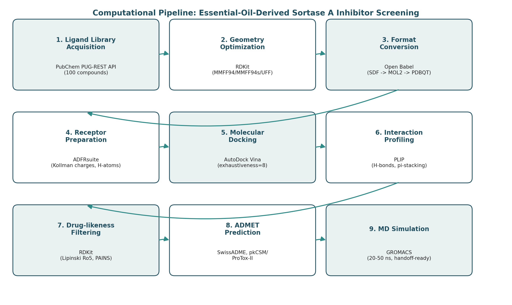
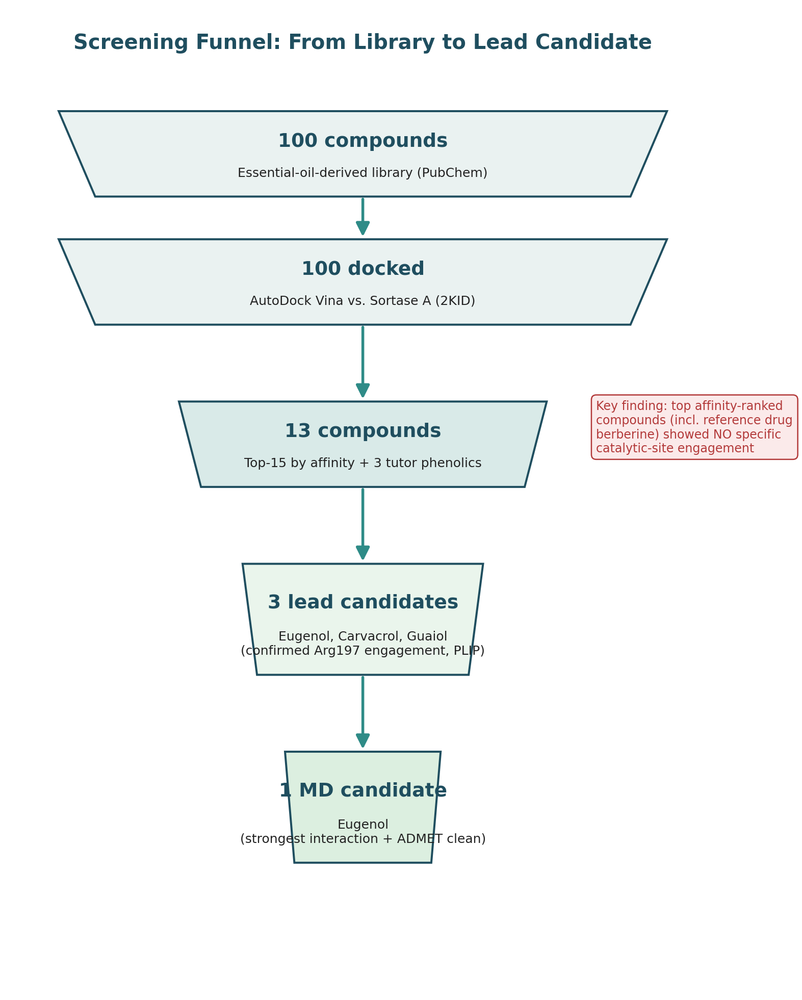

HEAD
# Sortase A Anti-Virulence Screening Pipeline

### Structure-Based Virtual Screening, Interaction Profiling, and ADMET Triage of Essential-Oil-Derived Phytochemicals Against *Staphylococcus aureus* Sortase A



---

## Table of Contents

1. [Project Description](#project-description)
2. [Technologies Used](#technologies-used)
3. [Target Audience](#target-audience)
4. [Features and Benefits](#features-and-benefits)
5. [Installation Instructions](#installation-instructions)
6. [Usage Guidelines](#usage-guidelines)
7. [Repository Structure](#repository-structure)
8. [Results Overview](#results-overview)
9. [Known Issues and Limitations](#known-issues-and-limitations)
10. [Roadmap / Future Development](#roadmap--future-development)
11. [Real-World Applications and Case Studies](#real-world-applications-and-case-studies)
12. [Contribution Guidelines](#contribution-guidelines)
13. [License](#license)
14. [Acknowledgments](#acknowledgments)
15. [References](#references)
16. [Contact](#contact)

---

## Project Description

This repository implements an end-to-end, reproducible computational pipeline for **structure-based anti-virulence drug discovery** against **Sortase A (SrtA)**, a membrane-anchored cysteine transpeptidase expressed by *Staphylococcus aureus* and other Gram-positive pathogens. SrtA catalyzes the covalent attachment of LPXTG-motif surface proteins — adhesins, toxins, and other virulence factors — to the peptidoglycan cell wall. Because SrtA is dispensable for bacterial viability but essential for pathogenicity, it represents a mechanistically distinct alternative to conventional bactericidal antibiotic targets: inhibiting it disarms an organism's capacity to cause disease without exerting the direct survival pressure that drives resistance evolution.

The pipeline screens a curated, 100-compound library of essential-oil-derived phytochemicals — phenolics, phenylpropanoids, monoterpenes, and sesquiterpenes — against SrtA using molecular docking, protein-ligand interaction profiling, physicochemical/drug-likeness filtering, and ADMET prediction, culminating in a ranked, mechanistically justified shortlist of candidate inhibitors and a molecular dynamics (MD) simulation handoff package for binding-pose validation.

**Significance.** Natural-product-derived anti-virulence agents are an increasingly important research direction as antimicrobial resistance erodes the utility of traditional bactericidal/bacteriostatic agents. This project's central methodological contribution — demonstrated empirically in its own results — is that **docking affinity score alone is an unreliable proxy for mechanistically meaningful target engagement**. The highest-scoring ligands in this screen, including the reference inhibitor, showed only non-specific hydrophobic contact with the receptor, while a lower-ranked phenylpropanoid (eugenol) exhibited the most extensive, specific hydrogen-bonding network with the catalytic arginine of any compound tested. This finding underscores the necessity of interaction-pattern analysis as a mandatory companion to, not a replacement for, affinity-based ranking in virtual screening workflows.

---

## Technologies Used

| Category | Tool / Library | Purpose |
|---|---|---|
| Language | Python 3.10+ | Core pipeline scripting |
| Language | Bash | Batch orchestration, HPC-style looped execution |
| Cheminformatics | [RDKit](https://www.rdkit.org/) | Geometry optimization, Lipinski filtering, PAINS structural alerts |
| Format conversion | [Open Babel](http://openbabel.org/) | SDF ⇄ MOL2 ⇄ PDBQT interconversion |
| Receptor preparation | [ADFRsuite](https://ccsb.scripps.edu/adfr/) | Hydrogen addition, Kollman charge assignment, PDBQT export |
| Structural visualization / analysis | [PyMOL](https://pymol.org/) | Chain isolation, active-site residue identification, grid-box centroid calculation |
| Molecular docking | [AutoDock Vina](https://vina.scripps.edu/) | Structure-based virtual screening |
| Interaction analysis | [PLIP](https://github.com/pharmai/plip) | Non-covalent interaction fingerprinting |
| ADMET prediction | [SwissADME](http://www.swissadme.ch/), pkCSM / ProTox-II (deep-pk) | Pharmacokinetic and toxicity prediction |
| Molecular dynamics | [GROMACS](https://www.gromacs.org/) | Production MD and trajectory analysis (handoff-ready) |
| Ligand force field parameterization | [acpype](https://github.com/alanwilter/acpype) (GAFF2/AM1-BCC) | MD-ready ligand topology generation |
| Data retrieval | PubChem PUG-REST API, NCI CACTUS | Ligand structure and property sourcing |
| Document generation | `python-docx`/`docx` (JS), `pptxgenjs` | Automated report and presentation assembly |

---

## Target Audience

This repository is written for an **advanced, technically literate audience**, specifically:

- Computational chemists and structural bioinformaticians conducting structure-based virtual screening
- Graduate and postgraduate students (MSc/PhD) in biochemistry, pharmacology, or bioinformatics undertaking a capstone or thesis project involving molecular docking
- Natural-product and medicinal chemistry researchers investigating phytochemical bioactivity
- Antimicrobial resistance (AMR) researchers exploring anti-virulence (rather than bactericidal) therapeutic strategies
- Bioinformatics instructors seeking a complete, reproducible reference pipeline for teaching structure-based drug discovery workflows

Familiarity with the Linux command line, basic Python, and foundational structural biology concepts (protein active sites, non-covalent interactions, force fields) is assumed.

---

## Features and Benefits

- **Fully scripted, reproducible pipeline** — every stage (ligand retrieval, optimization, docking, filtering, ADMET) is implemented as a standalone, parameterized script or batch job, minimizing manual, error-prone intervention.
- **Automatic multi-source ligand resolution with graceful fallback** — ligand structures are retrieved from PubChem by name, with an automatic fallback to NCI CACTUS for compounds that fail direct PubChem name-matching, and any resulting data gaps are explicitly flagged rather than silently interpolated.
- **Literature-informed receptor selection** — the receptor conformation (PDB 2KID) was selected specifically because published prior work identifies the apo conformation's active-site loop as disordered; this pipeline documents and justifies that structural decision rather than treating receptor choice as arbitrary.
- **Interaction-aware candidate ranking** — beyond raw docking scores, every top-ranked pose is profiled for hydrogen bonds, hydrophobic contacts, and π-cation/π-stacking interactions specifically with the catalytic triad, surfacing mechanistically meaningful hits that a pure-affinity ranking would miss.
- **Integrated drug-likeness and safety triage** — Lipinski Rule-of-Five and PAINS structural-alert filtering are applied across the full ligand library, with results traceable per compound.
- **Multi-source ADMET cross-validation** — pharmacokinetic and toxicity predictions are cross-referenced across two independent platforms (SwissADME and pkCSM/ProTox-II) rather than relying on a single tool's output.
- **Hardware-agnostic MD continuity** — a complete, self-contained MD handoff package (parameter files, prepared structures, step-by-step protocol) allows the pipeline's most compute-intensive stage to be executed on different hardware than the rest of the workflow, without loss of reproducibility or methodological continuity.
- **Automated, presentation-ready reporting** — final docking tables, ADMET tables, and the complete ligand inventory are compiled programmatically into submission-ready report and slide-deck formats, eliminating manual data transcription errors.

---

## Installation Instructions

### Prerequisites

- **Operating system:** Linux (native or WSL2 on Windows). This pipeline was developed and tested primarily on Ubuntu under WSL2.
- **Python:** 3.10 or later
- **Disk space:** ≥5 GB recommended (ligand libraries, docking outputs, and MD trajectories accumulate quickly)
- **RAM:** ≥8 GB recommended; MD stages benefit substantially from more
- **Optional but strongly recommended:** a CUDA-capable GPU for the molecular dynamics stage (GROMACS GPU offload)

### Step-by-Step Setup

```bash
# 1. Clone the repository
git clone https://github.com/<your-org>/sortase-a-eo-screening.git
cd sortase-a-eo-screening

# 2. Create and activate a Python virtual environment
python3 -m venv venv
source venv/bin/activate

# 3. Install Python dependencies
pip install --upgrade pip
pip install rdkit requests

# 4. Install system-level cheminformatics and docking tools
sudo apt update
sudo apt install -y openbabel autodock-vina dos2unix libxml2-16 libsm6 libice6 libxext6 libxrender1 libxt6

# 5. Install ADFRsuite (receptor/ligand preparation with Kollman charges)
wget https://ccsb.scripps.edu/adfr/download/1038/ -O ADFRsuite_install.tar.gz
tar -xf ADFRsuite_install.tar.gz
cd ADFRsuite_x86_64Linux_1.0 && ./install.sh -d ~/ADFRsuite-1.0 -c 0 && cd ..
echo 'export PATH="$HOME/ADFRsuite-1.0/bin:$PATH"' >> ~/.bashrc && source ~/.bashrc

# 6. Install PyMOL (structure preparation, active-site geometry)
sudo apt install -y pymol

# 7. Install PLIP (interaction profiling)
pip install plip
sudo apt install -y python3-lxml   # PLIP dependency

# 8. (Optional — MD stage) Install GROMACS and acpype
sudo apt install -y gromacs
pip install acpype --break-system-packages

# 9. Verify core tools are on PATH
python3 -c "import rdkit; print('RDKit OK')"
obabel -V
vina --version
prepare_receptor --help
plipcmd --version
```

> **Platform note:** if working under WSL, keep the project directory on the native Linux filesystem (e.g. `~/projects/`) rather than a `/mnt/c/...` Windows-mounted path. Cross-filesystem I/O under WSL is measurably slower for the hundreds of small files this pipeline generates, and Windows-originated text files frequently introduce CRLF line endings that break Bash scripts (`dos2unix <file>` resolves this).

---

## Usage Guidelines

The pipeline is organized into sequential stages. Each stage's script accepts `--help` for its full argument list; representative invocations are shown below.

### Stage 1 — Ligand Library Acquisition

```bash
python3 extract.py --input compounds_name.txt --output-dir output --delay 1.0
```
Retrieves 3D SDF structures (falling back to 2D via NCI CACTUS where necessary) and a full physicochemical property table (`compound_properties.csv`: MW, XLogP, TPSA, HBD, HBA, rotatable bonds) for every named compound.

### Stage 2 — Geometry Optimization

```bash
python3 optimize.py --input-dir output/numbered_sdf --output-dir output/optimized --auto --steps 2000
```
Auto-selects MMFF94s (aromatic-appropriate) or MMFF94/UFF per compound and writes optimized SDF and MOL2 structures.

### Stage 3 — Library Consolidation

```bash
python3 combine.py --input-dir output/optimized/optimized_sdf --output-dir output/combined --renaming-log output/numbered_sdf/renaming_log.csv --mol2
```
Merges all optimized ligands into a single multi-molecule file and generates `ligand_manifest.csv`, the canonical compound-name/CID/SMILES lookup table used by every downstream stage.

### Stage 4 — Receptor Preparation

```bash
# Isolate a single chain and confirm catalytic residues in PyMOL, then:
prepare_receptor -r receptor_chainA.pdb -o protein/receptor.pdbqt -A checkhydrogens -U nphs_lps_waters -v
```

### Stage 5 — Batch Ligand Conversion and Virtual Screening

```bash
bash convert_ligands.sh        # MOL2 -> individual PDBQT
bash screen_sortase.sh         # Dock all library ligands against the prepared receptor
```

### Stage 6 — Results Ranking

```bash
python3 parse_affinities.py --manifest output/combined/ligand_manifest.csv
```
Produces `binding_affinity_ranked.csv`, ranking every docked ligand by best predicted binding affinity (kcal/mol).

### Stage 7 — Interaction Profiling

```bash
plipcmd -f complexes/ligand78_complex.pdb -o plip_results/ligand78 -t --pymol
```
Run per top-ranked complex; parse output tables for contacts with catalytic-site residues of interest.

### Stage 8 — Drug-Likeness Filtering

```bash
python3 lipinski_pains_filter.py --properties output/compound_properties.csv --manifest output/combined/ligand_manifest.csv
```
Applies Lipinski's Rule of Five and RDKit's PAINS filter catalog across the full library.

### Stage 9 — ADMET Prediction

Submit shortlisted compounds' canonical SMILES to [SwissADME](http://www.swissadme.ch/) and [pkCSM/ProTox-II](https://biosig.lab.uq.edu.au/pkcsm/) (web-based; no local script required).

### Stage 10 — Molecular Dynamics (Handoff-Ready)

```bash
acpype -i ligand.mol2 -c bcc -n 0
gmx pdb2gmx -f protein.pdb -o protein_processed.gro -water tip3p
# ... solvation, ionization, minimization, equilibration, production —
# see MD_handoff_package/README.md for the complete, copy-paste-ready protocol.
```

---

## Repository Structure

```
sortase-a-eo-screening/
├── README.md
├── assets/
│   └── images/
│       ├── pipeline_architecture.png
│       └── results_funnel.png
├── extract.py                       # Stage 1: PubChem retrieval + properties
├── optimize.py                      # Stage 2: RDKit geometry optimization
├── combine.py                       # Stage 3: library consolidation
├── convert_ligands.sh               # Stage 5a: MOL2 -> PDBQT batch conversion
├── screen_sortase.sh                # Stage 5b: batch Vina docking
├── parse_affinities.py              # Stage 6: results ranking
├── lipinski_pains_filter.py         # Stage 8: drug-likeness filtering
├── MD_handoff_package/
│   ├── README.md                    # Full MD protocol for handoff execution
│   ├── ions.mdp / minim.mdp / nvt.mdp / npt.mdp / md.mdp
├── output/
│   ├── compound_properties.csv
│   ├── combined/ligand_manifest.csv
│   └── ...
├── docking_table_FULL.csv           # Complete 100-compound ranked results
├── full_lipinski_pains_100.csv      # Complete filtering results
├── ADMET_table.csv
└── Final_Report.docx / Final_Presentation.pptx
```

---

## Results Overview



Across the full 100-compound library, **99 of 100 compounds returned complete physicochemical data** (one compound, *o*-methoxycinnamaldehyde, resolved only via the NCI CACTUS structural fallback and lacks PubChem-derived property data as a result), and **effectively the entire evaluable library passed Lipinski's Rule of Five**. A single PAINS structural alert was raised, against thymoquinone's quinone moiety — a well-characterized, chemically expected flag for that substructure class.

The docking and interaction-profiling stages surfaced the project's principal finding: the two highest-scoring compounds by raw AutoDock Vina affinity, and the reference inhibitor berberine, showed **no specific engagement** with the SrtA catalytic triad (His120/Cys184/Arg197) — only non-specific hydrophobic contact. **Eugenol**, ranked 46th of 100 by affinity, instead formed **three hydrogen bonds plus a π-cation interaction** with the catalytic arginine (Arg197) — the most extensive specific interaction of any compound screened — and was carried forward, alongside carvacrol and guaiol, as a lead candidate on interaction-pattern rather than affinity-score grounds.

---

## Known Issues and Limitations

- **Single receptor conformation.** Docking was performed against one NMR-derived "activated" conformation (2KID); results were not cross-validated against the apo (1T2P) or substrate-trapped mutant (1T2W) structures within this project's timeframe, despite that comparison being methodologically informative. This remains a documented, deliberate scope limitation rather than an oversight.
- **Post-hoc, not pre-docking, drug-likeness filtering.** Lipinski/PAINS filtering was applied after docking rather than as an upstream library-reduction step, a deviation from some published virtual-screening conventions, adopted here for project-timeline reasons.
- **AutoDock Vina's empirical scoring function has known limitations** in discriminating specific polar/electrostatic complementarity from nonspecific hydrophobic burial — a limitation this project's own results directly illustrate rather than merely cite.
- **One ligand's property data is unavailable** (*o*-methoxycinnamaldehyde) due to a PubChem name-resolution failure; its docking result remains valid, but it was excluded from filtering statistics.
- **MD simulation was not executed in-house** due to local hardware constraints (no GPU, insufficient CPU throughput for a 20–50 ns production run); a complete, reproducible handoff package is provided in lieu of first-party results.
- **Environment fragility under WSL.** Several dependencies (Open Babel's bundled shared libraries, `reduce`'s hydrogen-dictionary path, line-ending handling) proved sensitive to the specific WSL/Ubuntu release in development; see the Roadmap section for planned containerization to eliminate this class of issue.

---

## Roadmap / Future Development

- [ ] **Containerize the full pipeline** (Docker/Singularity) to eliminate environment-specific dependency failures encountered during development (missing shared libraries, WSL path/line-ending issues).
- [ ] **Ensemble docking** across 2KID, 1T2P, and 1T2W to assess pose and ranking sensitivity to receptor conformational state.
- [ ] **Pre-docking Lipinski/PAINS filtering** as a first-class pipeline stage, reducing the screened library prior to the computationally expensive docking stage.
- [ ] **Automated batch PLIP profiling** across the full top-N ranked set (currently run per-complex, semi-manually) with programmatic aggregation of interaction fingerprints.
- [ ] **Completion of 20–50 ns production MD with MM-PBSA/MM-GBSA binding free energy estimation**, via the prepared handoff package, and incorporation of results into a revised report.
- [ ] **Expansion of the ligand library** to additional natural-product sources (COCONUT, IMPPAT) beyond the current PubChem-only sourcing.
- [ ] **In vitro validation** of the top computational candidates (enzymatic SrtA inhibition assay; *S. aureus* adhesion/virulence phenotype assays) in collaboration with a wet-lab partner.
- [ ] **CI-driven regression testing** of the scripted pipeline stages against a small reference ligand set, to catch tool/dependency-version regressions automatically.

---

## Real-World Applications and Case Studies

- **This project's own results** constitute a worked case study in anti-virulence natural-product screening: eugenol, a widely available, food-grade, GRAS-status phytochemical (clove oil's principal constituent), emerged as a mechanistically well-justified SrtA-engaging candidate — a translationally attractive starting point given its established safety profile, independent of this project's own docking findings.
- **Anti-virulence therapeutics more broadly** are an active clinical and translational research area for *S. aureus* and other Gram-positive pathogens, motivated by the resistance-evolution advantages of disarming pathogenicity rather than killing the organism outright; SrtA inhibitors specifically have been investigated as adjunctive anti-infective and anti-biofilm agents in the primary literature (see References).
- **Essential oils and their constituents** are independently well studied for topical antimicrobial and food-preservation applications; this pipeline's interaction-level analysis offers a mechanistic complement to that largely phenotypic literature, clarifying *which* constituents plausibly act via a defined molecular target rather than nonspecific membrane disruption alone.
- **The pipeline architecture itself** is reusable beyond this specific target/ligand pairing — any structure-based virtual screening project against a well-characterized enzyme active site can adopt this same retrieval → optimization → docking → interaction-profiling → filtering → ADMET → MD workflow with receptor- and library-specific parameters substituted in.

---

## Contribution Guidelines

Contributions are welcome from researchers and students extending or reusing this pipeline.

1. **Fork the repository** and create a feature branch (`git checkout -b feature/<short-description>`).
2. **Coding standards:**
   - Python code should follow [PEP 8](https://peps.python.org/pep-0008/); run `black` and `flake8` before submitting.
   - Bash scripts should pass `shellcheck` cleanly and use `set -euo pipefail`.
   - All scripts must accept command-line arguments via `argparse` (Python) or explicit flags (Bash) — no hardcoded paths.
   - New pipeline stages should write a manifest/log file documenting per-item success/failure status, consistent with the existing stages.
3. **Documentation:** any new script requires a docstring/header comment explaining inputs, outputs, and dependencies, and a corresponding entry in this README's Usage Guidelines section.
4. **Testing:** where feasible, validate new stages against a small (≤5 compound) reference ligand set before submitting.
5. **Submission process:** open a pull request against `main` with a clear description of the change, its motivation, and any new dependencies introduced. Link any relevant issue.
6. **Issue reporting:** please include your OS/environment details, the exact command run, and full error output (not a truncated excerpt) — environment-specific dependency issues have been a recurring theme in this project's development.

---

## License

This project is released under the **MIT License** for all original code (Python scripts, Bash scripts, report/diagram generation code).

```
MIT License

Copyright (c) 2026 Abbas

Permission is hereby granted, free of charge, to any person obtaining a copy
of this software and associated documentation files (the "Software"), to deal
in the Software without restriction, including without limitation the rights
to use, copy, modify, merge, publish, distribute, sublicense, and/or sell
copies of the Software, subject to the following conditions:

The above copyright notice and this permission notice shall be included in
all copies or substantial portions of the Software.

THE SOFTWARE IS PROVIDED "AS IS", WITHOUT WARRANTY OF ANY KIND, EXPRESS OR
IMPLIED, INCLUDING BUT NOT LIMITED TO THE WARRANTIES OF MERCHANTABILITY,
FITNESS FOR A PARTICULAR PURPOSE AND NONINFRINGEMENT.
```

Third-party structural data (PDB entry 2KID and related Sortase A structures) remain subject to the [RCSB PDB's own usage policies](https://www.rcsb.org/pages/policies) and are not covered by this license. Compound structures retrieved from PubChem are likewise subject to [PubChem's usage policy](https://pubchem.ncbi.nlm.nih.gov/docs/about).

---

## Acknowledgments

- **Course tutor and Summer School coordinators** (Group 1, Topic 1.3: Antimicrobial Drug Discovery) for project design, the shared Final Project Framework, and guidance on collaborative resolution of computational resource constraints.
- **The open-source scientific computing community**, whose tools — RDKit, Open Babel, AutoDock Vina, PLIP, GROMACS, PyMOL, ADFRsuite — make a project of this scope achievable outside a well-resourced institutional lab.
- **PubChem and the NCI CACTUS service**, for free, programmatically accessible chemical structure and property data.
- **SwissADME and pkCSM/ProTox-II (deep-pk) development teams**, for freely accessible ADMET prediction infrastructure.
- **Peer moderators and the course discussion group**, for computational support on the molecular dynamics stage where individual hardware proved insufficient — a collaborative model this project's MD handoff package is explicitly designed to support.

---

## References

1. Trott, O. & Olson, A. J. (2010). AutoDock Vina: Improving the speed and accuracy of docking with a new scoring function, efficient optimization, and multithreading. *Journal of Computational Chemistry*, 31(2), 455–461.
2. Adasme, M. F. et al. (2021). PLIP 2021: expanding the scope of the protein-ligand interaction profiler to DNA and RNA. *Nucleic Acids Research*, 49(W1), W530–W534.
3. O'Boyle, N. M. et al. (2011). Open Babel: An open chemical toolbox. *Journal of Cheminformatics*, 3, 33.
4. Daina, A., Michielin, O. & Zoete, V. (2017). SwissADME: a free web tool to evaluate pharmacokinetics, drug-likeness and medicinal chemistry friendliness of small molecules. *Scientific Reports*, 7, 42717.
5. Pires, D. E. V., Blundell, T. L. & Ascher, D. B. (2015). pkCSM: Predicting Small-Molecule Pharmacokinetic and Toxicity Properties Using Graph-Based Signatures. *Journal of Medicinal Chemistry*, 58(9), 4066–4072.
6. Lipinski, C. A. et al. (2001). Experimental and computational approaches to estimate solubility and permeability in drug discovery and development settings. *Advanced Drug Delivery Reviews*, 46(1–3), 3–26.
7. Baell, J. B. & Holloway, G. A. (2010). New Substructure Filters for Removal of Pan Assay Interference Compounds (PAINS) from Screening Libraries. *Journal of Medicinal Chemistry*, 53(7), 2719–2740.
8. Suree, N. et al. (2009). The structure of the *Staphylococcus aureus* sortase-substrate complex reveals how the universally conserved LPXTG sorting signal is recognized. *Journal of Biological Chemistry*, 284(36), 24465–24477. *(NMR "activated" model class corresponding to PDB 2KID.)*
9. Zong, Y., Bice, T. W., Ton-That, H., Schneewind, O. & Narayana, S. V. L. (2004). Crystal structures of *Staphylococcus aureus* sortase A and its substrate complex. *Journal of Biological Chemistry*, 279(30), 31383–31389. *(PDB 1T2P, 1T2W.)*
10. Chenna, B. C. et al. and related SrtA inhibitor discovery literature — representative of the broader anti-virulence SrtA inhibitor research context motivating this project's target selection.
11. Abraham, M. J. et al. (2015). GROMACS: High performance molecular simulations through multi-level parallelism from laptops to supercomputers. *SoftwareX*, 1–2, 19–25.
12. Landrum, G. RDKit: Open-source cheminformatics. https://www.rdkit.org

---

## Contact

**Project author:** Abbas
**Affiliation:** MSc Biotechnology, Bayero University Kano; Graduate Assistant, University of Abuja
**Email:** abbasaliyu36@gmail.com
**Project submission channel:** events.chem@gmail.com (Summer School Group 1, Topic 1.3)

For technical issues specific to this pipeline's code, please open an issue in this repository with full environment details and error output. For questions about the underlying research (target rationale, candidate selection, MD handoff), contact the author directly via the email above.
=======
# sortase-a-eo-screening
Docking and Molecular Dynamics Simulation of Essential Oil Compounds Against Bacterial Sortase A; An Anti-Virulence Computational Drug Discovery Approach
ee5e91f7efb2309a541d059a0aeabf89b4c74527
